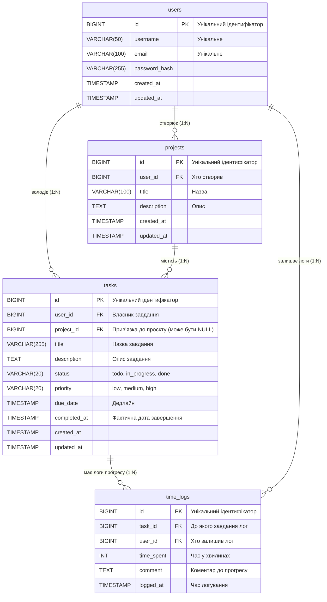

```mermaid
erDiagram
    %% Таблиця Користувачів
    users {
        BIGINT id PK "Унікальний ідентифікатор"
        VARCHAR(50) username "Унікальне"
        VARCHAR(100) email "Унікальне"
        VARCHAR(255) password_hash 
        TIMESTAMP created_at 
        TIMESTAMP updated_at 
    }

    %% Таблиця Проєктів (Категорій)
    projects {
        BIGINT id PK "Унікальний ідентифікатор"
        BIGINT user_id FK "Хто створив"
        VARCHAR(100) title "Назва"
        TEXT description "Опис"
        TIMESTAMP created_at 
        TIMESTAMP updated_at 
    }

    %% Таблиця Завдань
    tasks {
        BIGINT id PK "Унікальний ідентифікатор"
        BIGINT user_id FK "Власник завдання"
        BIGINT project_id FK "Прив'язка до проєкту (може бути NULL)"
        VARCHAR(255) title "Назва завдання"
        TEXT description "Опис завдання"
        VARCHAR(20) status "todo, in_progress, done"
        VARCHAR(20) priority "low, medium, high"
        TIMESTAMP due_date "Дедлайн"
        TIMESTAMP completed_at "Фактична дата завершення"
        TIMESTAMP created_at 
        TIMESTAMP updated_at 
    }

    %% Таблиця Трекінгу часу
    time_logs {
        BIGINT id PK "Унікальний ідентифікатор"
        BIGINT task_id FK "До якого завдання лог"
        BIGINT user_id FK "Хто залишив лог"
        INT time_spent "Час у хвилинах"
        TEXT comment "Коментар до прогресу"
        TIMESTAMP logged_at "Час логування"
    }

    %% Зв'язки (Relationships)
    users ||--o{ projects : "створює (1:N)"
    users ||--o{ tasks : "володіє (1:N)"
    projects ||--o{ tasks : "містить (1:N)"
    tasks ||--o{ time_logs : "має логи прогресу (1:N)"
    users ||--o{ time_logs : "залишає логи (1:N)"
```
